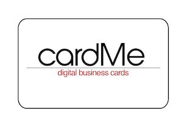
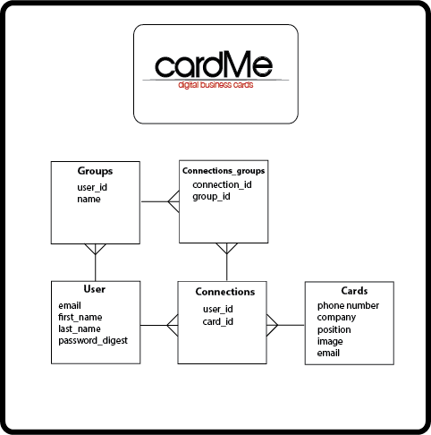

#### GA WDI NYC JAN, Project 2

##### An application that allows you to easily share your business card with anyone. 

  * When a user signs up for a cardMe account they can create a customizable business card.
  * Once logged in a user is taken to their dashboard containing 2 input fields at the top.
    - One field will automatically send a text message link to their business card to any phone
    - The other field will automatically email their business card to any email address with an image of the business card that acts as a link to their cardMe page
  * When a user visits another users business card they have the option to add that card to their personal rolodex
  * The user has a link on their dashboard to their rolodex where they have added other business cards from other users
  * The rolodex page returns the front and back of a card as well as extended information about that person/business including:
    - A summary of the company on the card
    - Recent news articles about that business

##### GEMS and API's
  * Paperclip
  * Freebase
  * NY Times

##### Pivotal Tracker and Heroku Links
- [Pivotal Tracker](https://www.pivotaltracker.com/s/projects/1040258)
- Heroku Link Pending

##### ERD for the project

